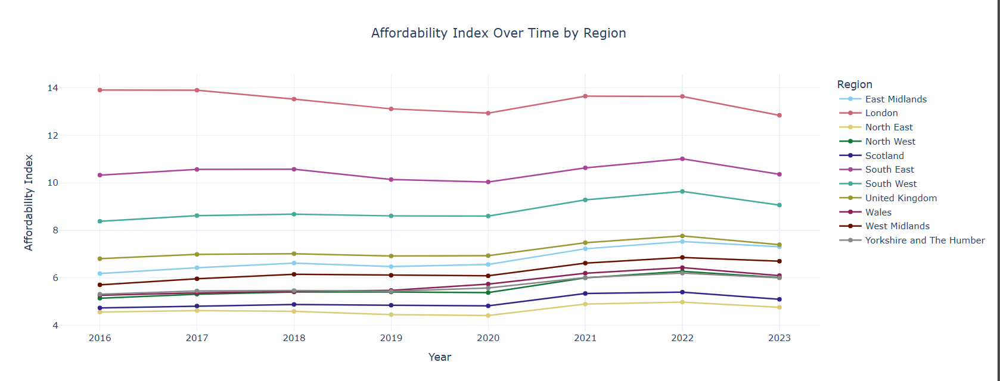
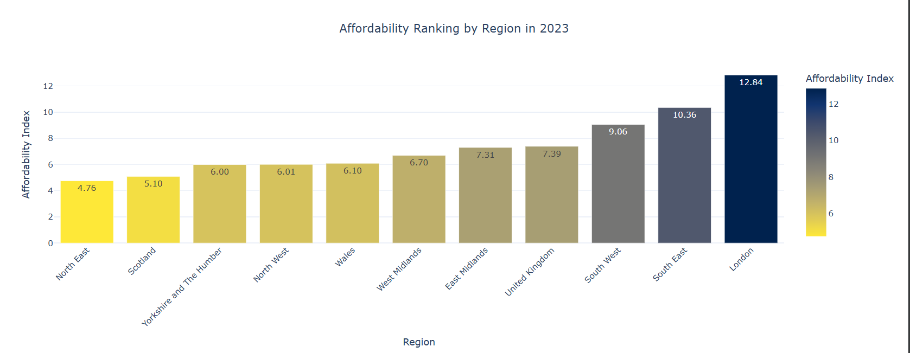
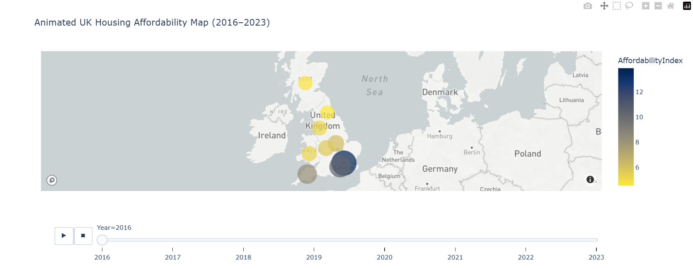
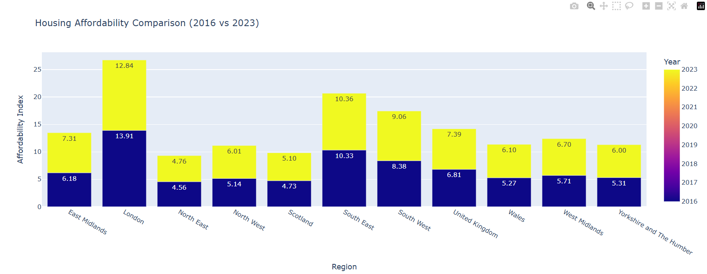
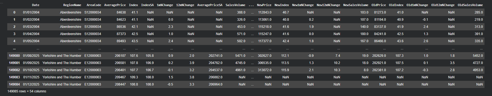
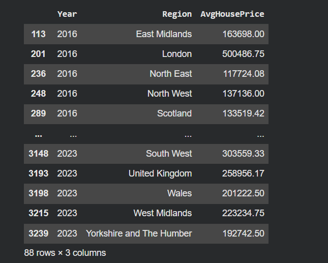
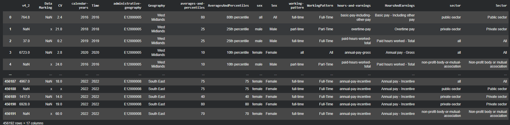
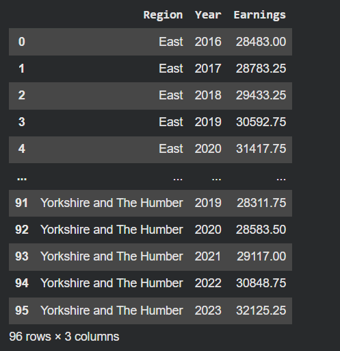
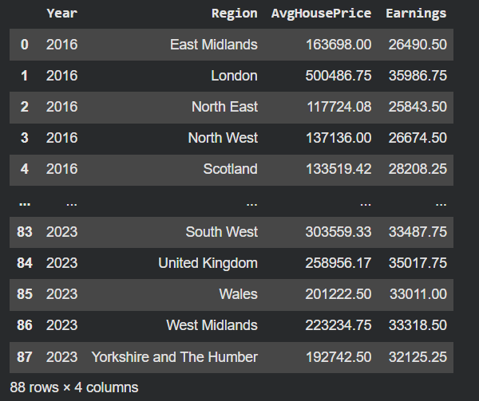
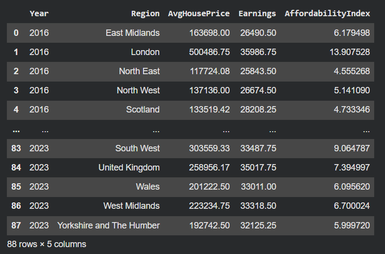

# UK Housing Affordability Analysis

## Overview
This project analyses housing affordability across UK regions by combining house price data (UK HPI) with earnings data (ONS ASHE). The goal is to understand how affordable housing is and how this has changed over time.

---

## Objective
- Calculate affordability index (House Price / Earnings)
- Compare affordability across regions
- Analyse trends from 2016 to 2023
- Identify regions under the most pressure

---

## Tools Used
- Python
- Pandas
- NumPy
- Plotly
- Matplotlib

---

## Methodology
1. Data cleaning and preprocessing  
2. Standardising region names  
3. Aggregating house prices yearly  
4. Merging with earnings data  
5. Creating affordability index  
6. Visualising trends and comparisons  

---

## Visualisations

### Affordability Trend Over Time

### Regional Affordability (2023)

### Affordability Heatmap

### Affordability Change (2016 vs 2023)

---

## Dataset Preview

### UK House Price Index (HPI)

### HPI After Cleaning

### ASHE Earnings Dataset

### ASHE After Cleaning

### Merged Dataset

### Affordability Index Calculation

---

## Key Insights
- London and South East have the highest affordability pressure  
- House prices are rising faster than earnings  
- Affordability has worsened over time in most regions  
- Regional inequality in housing affordability is increasing  

---

## How to Run
1. Clone the repository  
2. Install required libraries  
3. Open the notebook  
4. Run all cells  

---

## Author
Gaurav Parashar  
MSc Business Analytics  
Robert Gordon University
